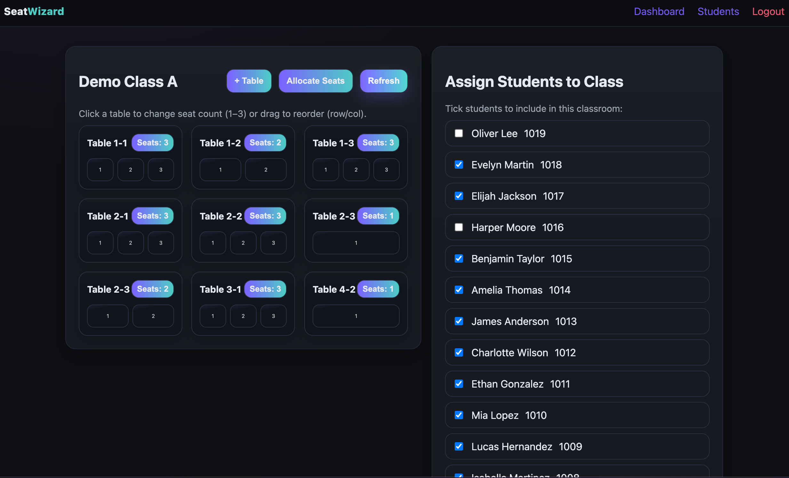

# Seat Allocator

A simple classroom seat allocation tool for teachers. Manage students and friend groups, define tables, and generate fair seat placements in one click.

[Live Demo](https://student-allocator.vercel.app)

## Allocation algorithm
1. Normalize tables and sort by grid position (row, then col). Initialize each with an empty `assigned` list.
2. Default strategy `spread_groups`:
   - Score each candidate table by remaining capacity (higher is better).
   - Softly penalize assigning two members of the same friend group to the same table.
   - Optional `frontWeight` adds a small bias for lower row indices (front of room).
3. Alternative strategy `round_robin`:
   - Traverse tables in order and fill the next available seat, cycling through tables.
4. Place all students in a single pass using the chosen strategy and tie‑break by row/col.
5. Return the final table list with `assigned` student IDs per seat index.

Notes
- Greedy and deterministic given identical inputs and options.
- If `students.length > totalSeats`, the API responds `400 Not enough seats for all students`.

### Alternatives
- Strict round‑robin by table order: guarantees even distribution, weaker at avoiding local congestion late in the process.
- Weighted tables: bias certain rows/cols (e.g., front rows) by adding a weight to “remaining seats.”
- Separation constraints: add soft penalties (e.g., avoid placing same-group students on same table) by skipping candidate tables if any assigned member already sits there.
- Randomized tie-breaking: introduces variety at the cost of determinism.

### Frontend behavior
- Before allocation, the client syncs the latest selected students to the server to ensure deselected students are not assigned.
- Seat rendering resets unassigned seats to their index label and marks assigned seats with the student name.

## Tech
- API: Next.js API routes (MongoDB via Mongoose, JWT auth, bcryptjs).
- UI: static pages (HTML/CSS/JS) served by Next during transition to React.

## Run locally
1. Create `web/.env.local`:
   - `MONGO_URI=...`
   - `JWT_SECRET=...`
2. Install and run:
   - `cd web && npm install`
   - `npm run dev`
3. Open `http://localhost:3000`.

## Demo

